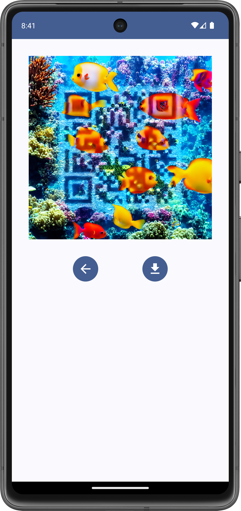

# Android application for custom QR code generation

The application allows users to generate unique artistic QR codes for their websites or personal use by providing text-based descriptions of the desired appearance. 

## Demo
For testing, install the APK on the Android device. You can download APK [here](https://github.com/ViktoriiaRoi/AiQrCode/releases/latest).

Note that the backend part is not running constantly. If you want to test the application, you can contact us to start the server.
- Email: victoriyaroi2003@gmail.com
- Telegram: [@viktoriia_roi](t.me/viktoriia_roi)

## Overview
The application provides custom QR codes that are visually appealing and easily scannable. The intuitive interface simplifies the design process, making it accessible to users with varying levels of technical proficiency and design expertise.

### Features
- **Custom Design**: input descriptive text or keywords, which will be used to generate a unique design.
- **Code Content**: supports different types of content such as text or URL.
- **Weight**: use parameter to fine-tune the balance between creativity and readability.
- **Preview**: before saving, users can preview generated QR codes to improve some parameters.
- **Saving**: users can save generated QR codes to their gallery.
### Design
- The first screen is the settings panel where users can specify the details for their QR code. The user needs to input the desired website URL and descriptive text prompt into the respective text fields. They can also adjust the weight parameter via a slider to set a balance between creativity and readability. Once the user has finalized their preferences, they can press the "Generate" button. The process of generating the QR code may take up to 30 seconds, after which the application navigates to the next screen.
- The second screen displays the outcome of QR code generation. Users can preview the resulted image and interact with two buttons below it. They can use the navigation button to go back to the previous screen and adjust some input parameters. If the user is satisfied with the result, they can save the generated image to the gallery using the "Save" button.

 

### Server
The Stable Diffusion model is deployed on the server, which allows the use of more powerful hardware. This setup also allows the mobile application to remain lightweight and responsive, as it only needs to send API requests to the server and receive the generated images. To simplify the interaction with the Stable Diffusion model, we use the open-source tool [stable-diffusion-webui](https://github.com/AUTOMATIC1111/stable-diffusion-webui).
